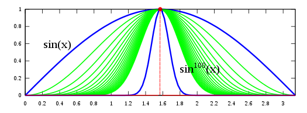
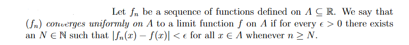
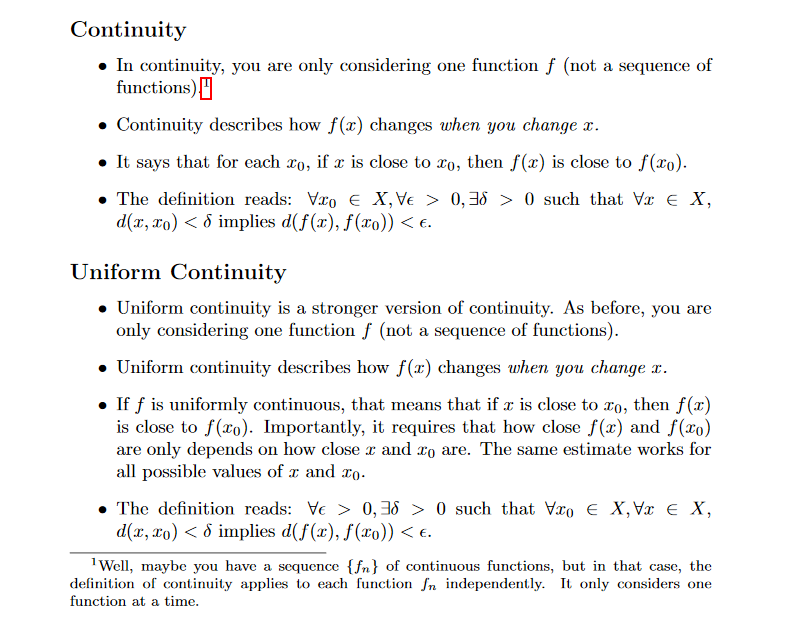
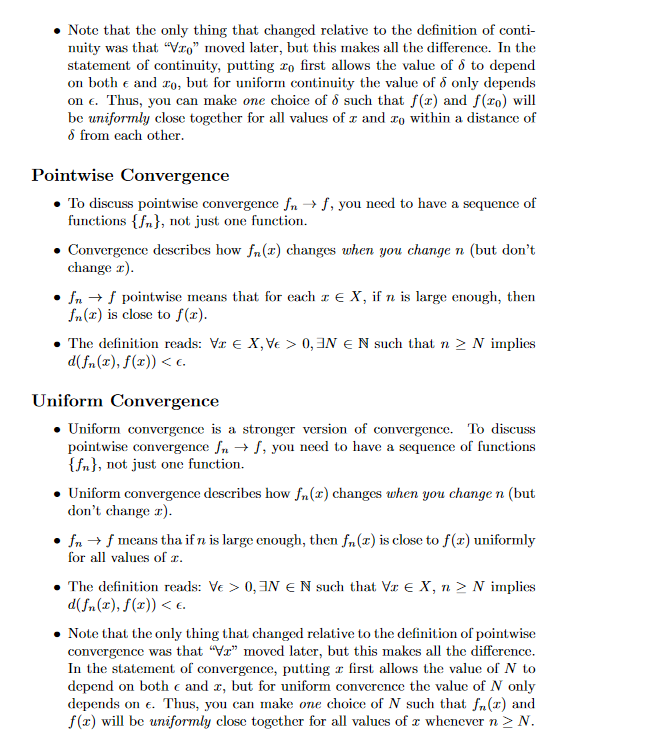

- [delta-epsilon-proof](http://www.milefoot.com/math/calculus/limits/DeltaEpsilonProofs03.htm)

## Pointwise limit

[Will your name become extinct?](https://www.youtube.com/watch?v=z34XhE5oRwo)

[solution link](https://math.stackexchange.com/a/1680927/726308)

[Can you raise a number to an irrational exponent?](https://math.stackexchange.com/q/55068/726308)

> the limit function of any uniformly convergent sequence of continuous functions is always continuous

Investigating whether a convergence is uniform or not, we consider

## Continuity vs convergence

## Lecture-02 (Proof 6.3.1)

We can exchange limit concept with delta-epsilon concept whenever need [22:00-24:00](https://www.youtube.com/watch?v=qteQ6PdyHWY&list=PLdMfoghed2YIDsRZlN2CfJHuKl4-c5XEo&index=10&t=1518s)

## Lecture-03 (Proof 6.3.2)

- [Proof X^n is not uniform convergent](https://en.wikipedia.org/wiki/Uniform_convergence#Examples)

We can give an equivalent alternative formulation for uniform convergence in term of cauchy if the space is (complete) metric space

## Lecture-04

UC implies limit and integration of dequence of function is commutative.

6.4.1 - 6.4.5

## Lecture-05

If a series of sequence of function is convergence then their [property](https://www.youtube.com/watch?v=U1Z0KRuUnMw&list=PLdMfoghed2YIDsRZlN2CfJHuKl4-c5XEo&index=8&t=1654s)

## Lecture-06

Several variable calculus

## Lecture-08

## http://www.supermath.info/math332.pdf

## Lecture-17

Theorem 3.2 several variable calculus

## Self

- [Differentiable Functions from Rn to Rm and Their Components ](http://mathonline.wikidot.com/differentiable-functions-from-rn-to-rm-and-their-components)

- [Derivative of Linear Map](https://math.stackexchange.com/questions/392237/derivative-of-linear-map)

- Show that, if 𝑈⊆ℝ𝑛 is connected and open, and 𝑓:𝑈→ℝ is differentiable with 𝐷𝑓=0 , show 𝑓 is constant

https://math.stackexchange.com/questions/1946800/show-that-if-u-subseteq-mathbbrn-is-connected-and-open-and-fu-rightarr

[Clear the topology definition from comment section](https://math.stackexchange.com/questions/4127386/exercise-2-from-terry-tao-blogsite-on-compactness)

## [Chain Rule](https://sites.und.edu/timothy.prescott/apex/web/apex.Ch13.S5.html)

Chain Rule is extremely powerful when we do not know what f, g and/or h are. It may be hard to believe, but often in “the real world” we know rate-of-change information (i.e., information about derivatives) without explicitly knowing the underlying functions. The Chain Rule allows us to combine several rates of change to find another rate of change. The Chain Rule also has theoretic use, giving us insight into the behavior of certain constructions (as we’ll see in the next section).

http://www.math.toronto.edu/courses/mat237y1/20199/contents.html

[Limit point of sequence vs limit point of the set containing all point of the sequence](https://math.stackexchange.com/q/577198/736159)
