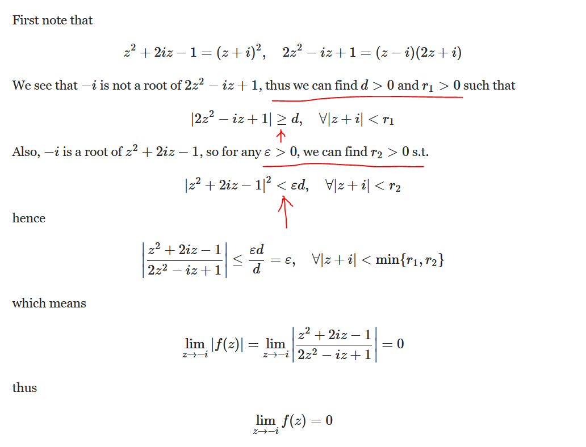
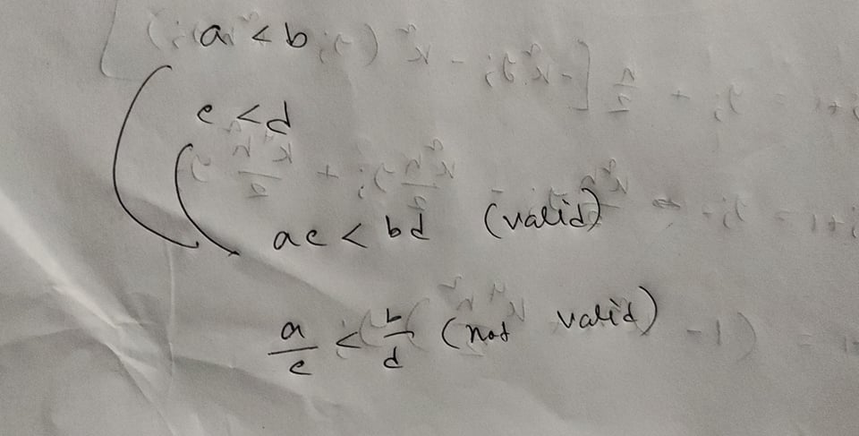
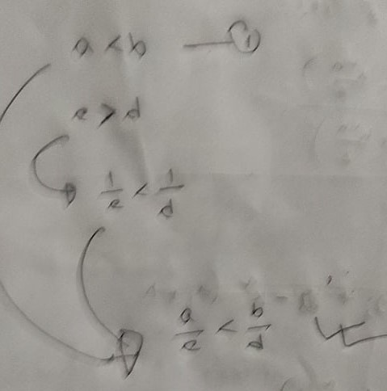
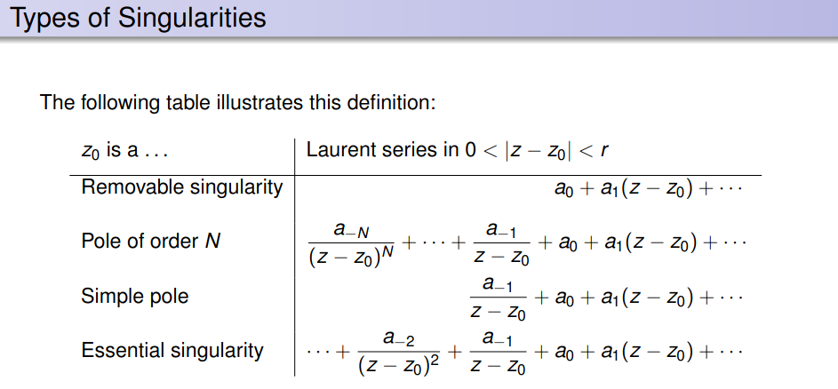
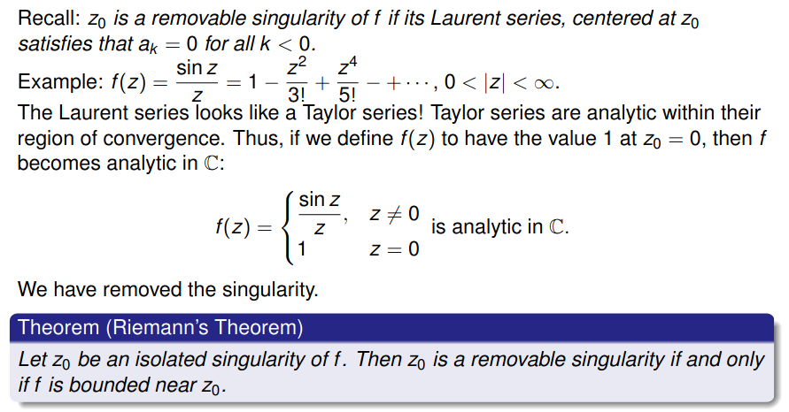
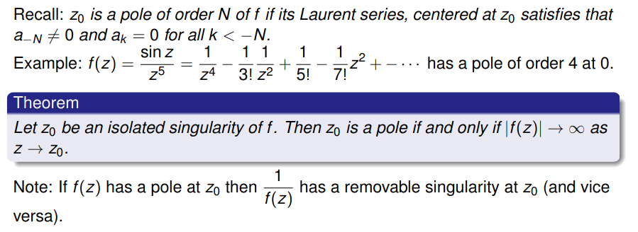
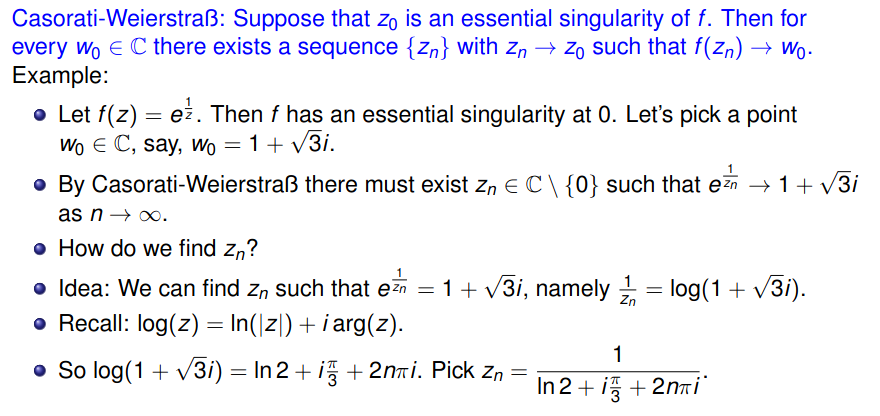

> Not only for complex plane but also for n dimension, if we take open ball to trace out the derivative (as we do for 1-dimension with LHS and RHS limit) then it give you weather the function is differentiable at that point or not.

## Lecture-02

- [the product of all the nth roots of unity](https://math.stackexchange.com/q/115558/565609)
- from where hyperbolic function come
- https://math.rice.edu/~polking/cartography/cart.pdf
- [Stereographic projection formulation](https://www.youtube.com/watch?v=b5VUnapu-qs)

## Lecture-03

[complex-cross-product](https://proofwiki.org/wiki/Definition:Vector_Cross_Product)

[grad-div-curl](http://mathonline.wikidot.com/the-divergence-and-curl-of-a-vector-field-in-two-dimensions)

- There is a fundamental difference from functions of a real variable: there, we could approach a point on the curve y=g(x) either from the left or from the right when considering limits of g(x) at such points. With the function f(z) we are allowed to approach the point z=z0 along any ath in the z-plane; we require merely that the distance |z−z0| decreases to zero.

- Let L be a straight line through z1 and z2 in the complex plane. L can be expressed by the equation: z=z1+t(z2−z1)
- [Multi-valued function and Branches](https://www.youtube.com/watch?v=K4ZJ-bDQHGA)

- https://complex-analysis.com/

> A remarkable feature of complex differentiation is that the existence of one complex derivative automatically implies the existence of infinitely many! This is in contrast to the case of the function of real variable g(x), in which g′(x) can exists without the existence of g′′(x).

> Let f: A → C where A ⊂ C is an open set. The function is said to be analytic on A if f is differentiable at each z0 ∈ A.

> L'Hopital's rule is a local statement: it concerns the behavior of functions near a particular point. The global issues (multivaluedness, branch cuts) are irrelevant for this case.

- [L'Hopital's rule](https://math.stackexchange.com/questions/2022436/a-proof-of-lhopitals-rule-for-complex-functions)

## Lecture-04

### important

- **Cauchy-riemann equation => Analytic**
- **Cauchy-riemann equation => Harmonic**

[Jacobian](https://math.stackexchange.com/q/14952/726308)

## Lecture-05

Some important example was shown. Will be best for exam follow these

https://math.stackexchange.com/questions/1687462/counter-example-cauchy-riemann-equations-does-not-imply-differentiability

https://www.math24.net/differential-function/

https://www.britannica.com/science/analysis-mathematics

http://www1.spms.ntu.edu.sg/~ydchong/teaching.html

There is a standard procedure to convert multi-valued operations into functions. First,
we define one or more curve(s) in the complex plane, called branch cuts (the reason for
this name will be explained later). Next, we modify the domain (i.e., the set of permissible
inputs) by excluding all values of z lying on a branch cut. Then the outputs of the multivalued
operation can be grouped into discrete branches, with each branch behaving just
like a function.

> why conformal mappings are one-to-one?

If a function is holomorphic and the derivative never vanishes, then the function is locally conformal.

Mobius transformations preserve angles, map every straight line to a line or circle, and map every circle to a line or circle. The Mobius transformations are the projective transformations of the complex projective line. They form a group called the Mobius group, which is the projective linear group PGL(2,C). Together with its subgroups, it has numerous applications in mathematics and physics.

[Conformal Mapping | Möbius Transformation](https://www.youtube.com/watch?v=48aerHs9wL0)

## Laurent series

## Laurent Series Explained | How to Determine Laurent Series | Complex Analysis #9

https://www.youtube.com/watch?v=RC15R-ktnUI

## Conformal Mapping | image under conformal maps

https://www.library.gscgandhinagar.in/assets/admin/images/MAT-303(UNIT%203).pdf

## Taylor and Laurent series

https://math.mit.edu/~jorloff/18.04/notes/topic7.pdf

## Coursera final

- [analytic functions from square to unit disk](https://math.stackexchange.com/questions/28714/analytic-functions-from-square-to-unit-disk)
- [Finding Radii of Convergence for anz^2n](https://math.stackexchange.com/questions/699224/finding-radii-of-convergence-for-sum-a-n-z2n-and-sum-a-n2-zn)
- [Find where converges or diverges](https://math.stackexchange.com/questions/1632205/find-where-sum-n-0-infty-a-nz3-in-converges-or-diverges)
- https://math.mit.edu/~jorloff/18.04/notes/topic9.pdf
- [Conformal map but not analytic](https://math.stackexchange.com/questions/2403204/conformal-map-but-not-analytic)
- [Finding a conformal map from unit disk to half-plane](https://math.stackexchange.com/questions/228630/finding-a-conformal-map-from-unit-disk-to-half-plane?rq=1)
- [Is the complex exponential function injective, surjective and/or bijective - and why?](https://math.stackexchange.com/questions/21191/is-the-complex-exponential-function-injective-surjective-and-or-bijective-and)
- [Singularities, essential singularities, poles, simple poles](https://math.stackexchange.com/questions/1284316/singularities-essential-singularities-poles-simple-poles)

https://math.mit.edu/~jorloff/18.04/notes/topic9.pdf

https://socratic.org/calculus/power-series/determining-the-radius-and-interval-of-convergence-for-a-power-series

## Differentiation of power series page:7

https://www.math.ucdavis.edu/~hunter/m125a/intro_analysis_ch6.pdf

## Why imaginary numbers are needed to understand the radius of convergence

https://www.youtube.com/watch?v=83exawMU9Fg

## The beauty of complex numbers

https://www.youtube.com/watch?v=6_u18uFEoN0

https://www.youtube.com/watch?v=8tiQl6T-inE
