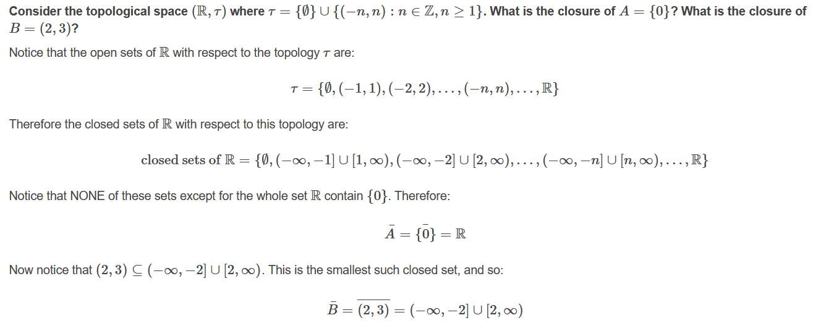

[Set-Theory](https://www.britannica.com/science/set-theory/Axiomatic-set-theory)

## Why should one study topology?

[Topology](https://www.britannica.com/science/topology) studies [properties of spaces](https://uwaterloo.ca/pure-mathematics/about-pure-math/what-is-pure-math/what-is-topology) that are invariant under any continuous deformation. It is sometimes called "rubber-sheet geometry"

> General topology normally considers local properties of spaces, and is closely related to analysis. Combinatorial topology considers the global properties of spaces, built up from a network of vertices, edges, and faces. Algebraic topology also considers the global properties of spaces, and uses algebraic objects such as groups and rings to answer topological questions. Differential topology considers spaces with some kind of smoothness associated to each point.

> replacing the metric by a notion of open set

(connectedness+compactness) carry by continuity

- The topology on a set often tells you in a sense what kind of control you have over an element of the set.
- Topology lets us talk about the notion of closeness (i.e., neighborhoods), which in turn allows us to talk about things such as continuity, convergence, compactness, and connectedness without the notion of a distance. [here](https://www.quora.com/Why-is-topology-important)

Two sets A and B are said to have the same cardinality if there exists a bijection
from A onto B.

The operations (∞− ∞), (−∞) − (−∞), +∞/+∞, −∞/−∞, and 0/0 are undefined.

## Lecture-01

https://www.emathzone.com/tutorials/general-topology/

The fundamental concepts in point-set topology are continuity, compactness, and connectedness.

- The collection of the non empty set and the set X itself is always a topology on X, and is called the indiscrete topology on X
- The power set P(X) of a non empty set X is called the discrete topology on X

If τ1 and τ2 are two topologies defined on the non empty set X such that τ1⊆τ2, i.e. each member of τ1 is also in τ2,
then τ1 is said to be coarser or weaker than τ2 and τ2 is said to be finer or stronger than τ1.

> The topology which is both discrete and indiscrete such topology which has one element in set X. i.e. X = {a}, τ={ϕ, X}.
> Every singleton set is discrete as well as indiscrete topology on that set.

> The intersection of any two topologies on a non empty set is always topology on that set, while the union of two topologies may not be a topology on that set.

Consider the Cartesian plane R^2, then the collection of subsets of R^2 which can be expressed as a union of open discs or open rectangles with **edges parallel to
the coordinate axis** from a topology, and is called a usual topology on R^2.

### Open Subset of a Topological Space

> Every subset of a topological space is open if and only if its each singleton subset is open.

Definition: Let (X,τ) be a topological space. If A⊆X is such that A∈τ then A is said to be Open. A subset A⊆X is said to be Closed if A'=X∖A is open. If A⊆X are both open and closed, then A is said to be Clopen.

if (X,τ) is a topological space and A⊆X then a point a∈A is called an interior point of A if there exists an open set U∈τ such that: a ∈ U ⊆ A

### Important notes:

- To make a set `X` into a topological space, you introduce a relation, "touches," between the elements of `X` and the subsets of `X`. This relation must follow some properties. In Joshi's Introduction to General Topology, and in most of the literature, this kind of relation is called a nearness relation.
- A connected set is a set that cannot be partitioned into two nonempty subsets which are open in the relative topology induced on the set. Equivalently, it is a set which cannot be partitioned into two nonempty subsets such that each subset has no points in common with the set closure of the other.
- The closure of a disconnected set is disconnected.
- The interior of a disconnected set is connected.

[Interior-Closure-Rational](https://math.stackexchange.com/questions/2974303/interior-and-closure-of-mathbbq-cap-0-1)

## Lecture-04

Interior+Exterior+Boundary+nowhere Dense+Neighborhood

- A−B=A∩B' or A−B=A∖B={x∣x∈A and x∉B}
- A neigborhood of a point is not necessarily an open set.

## Lecture-05+06

T2 space+subspace+Hereditary property+Base(open base)+Subbase

> In mathematics, a base (or basis) ℬ of a topology on a set X is a collection of subsets of X such that every finite intersection of elements of ℬ (including X itself, which is, by a standard convention, the empty intersection) is a union of elements of ℬ.

In words, the second property says: given a point x in the intersection of two elements of the
basis, there is some element of the basis containing x and contained in this intersection.

[A Suff. Condition for a Collection of Sets to be a Base of a Topology](http://mathonline.wikidot.com/a-sufficient-condition-for-a-collection-of-sets-to-be-a-base)

Bases and subbases "generate" a topology in different ways. Every open set is a union of basis elements. Every open set is a union of finite intersections of subbasis elements.

A subbasis can be thought of, and is actually defined to be, the "smallest set that becomes my topological space if I complete it under the property of being a topological space, i.e. fulfiling the axioms of topological space".

The basic idea is that a basis is the collection of all finite intersections of sub-basis elements. The open sets in a topology are all possible unions of basis elements. So, the open sets in a topology are all possible unions of finite intersections of sub-basis elements.

[subbase generate topology](https://math.stackexchange.com/questions/322261/if-a-collection-of-sets-is-a-subbase-for-a-topology-tau-0-and-a-base-for-a-to/322272#322272)

If S is a partition of X then the collection of finite (non-empty) intersections of S will be S∪{∅}.

## last axiom of neighborhood system

[N3](https://math.stackexchange.com/a/2369687/736159)

[Overview of basic results about images and preimages](https://math.stackexchange.com/questions/359693/overview-of-basic-results-about-images-and-preimages)
