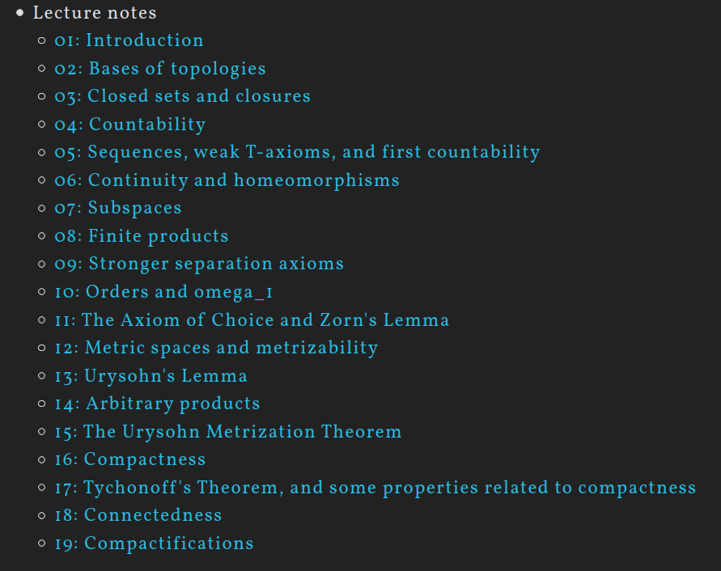
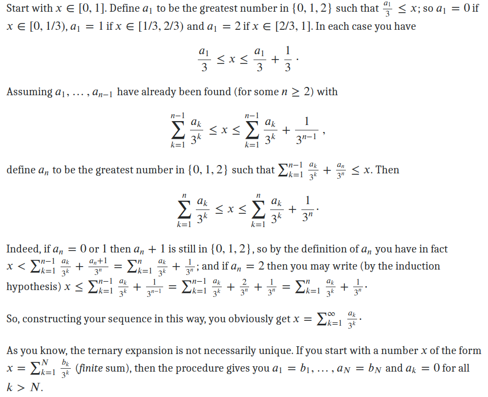

[Tricki: mathematical problem-solving techniques](http://www.tricki.org/)

[Set-Theory](https://www.britannica.com/science/set-theory/Axiomatic-set-theory)

## Why should one study topology?

[Topology](https://www.britannica.com/science/topology) studies [properties of spaces](https://uwaterloo.ca/pure-mathematics/about-pure-math/what-is-pure-math/what-is-topology) that are invariant under any continuous deformation. It is sometimes called "rubber-sheet geometry"

> General topology normally considers local properties of spaces, and is closely related to analysis. Combinatorial topology considers the global properties of spaces, built up from a network of vertices, edges, and faces. Algebraic topology also considers the global properties of spaces, and uses algebraic objects such as groups and rings to answer topological questions. Differential topology considers spaces with some kind of smoothness associated to each point.

> replacing the metric by a notion of open set

(connectedness+compactness) carry by continuity

- The topology on a set often tells you in a sense what kind of control you have over an element of the set.
- Topology lets us talk about the notion of closeness (i.e., neighborhoods), which in turn allows us to talk about things such as continuity, convergence, compactness, and connectedness without the notion of a distance. [here](https://www.quora.com/Why-is-topology-important)

Two sets A and B are said to have the same cardinality if there exists a bijection
from A onto B.

The operations (∞− ∞), (−∞) − (−∞), +∞/+∞, −∞/−∞, and 0/0 are undefined.

## Lecture-01

https://www.emathzone.com/tutorials/general-topology/

The fundamental concepts in point-set topology are continuity, compactness, and connectedness.

- The collection of the non empty set and the set X itself is always a topology on X, and is called the indiscrete topology on X
- The power set P(X) of a non empty set X is called the discrete topology on X

If τ1 and τ2 are two topologies defined on the non empty set X such that τ1⊆τ2, i.e. each member of τ1 is also in τ2,
then τ1 is said to be coarser or weaker than τ2 and τ2 is said to be finer or stronger than τ1.

> The topology which is both discrete and indiscrete such topology which has one element in set X. i.e. X = {a}, τ={ϕ, X}.
> Every singleton set is discrete as well as indiscrete topology on that set.

> The intersection of any two topologies on a non empty set is always topology on that set, while the union of two topologies may not be a topology on that set.

Consider the Cartesian plane R^2, then the collection of subsets of R^2 which can be expressed as a union of open discs or open rectangles with **edges parallel to
the coordinate axis** from a topology, and is called a usual topology on R^2.

### Open Subset of a Topological Space

> Every subset of a topological space is open if and only if its each singleton subset is open.

Definition: Let (X,τ) be a topological space. If A⊆X is such that A∈τ then A is said to be Open. A subset A⊆X is said to be Closed if A'=X∖A is open. If A⊆X are both open and closed, then A is said to be Clopen.

if (X,τ) is a topological space and A⊆X then a point a∈A is called an interior point of A if there exists an open set U∈τ such that: a ∈ U ⊆ A

### Important notes:

- To make a set `X` into a topological space, you introduce a relation, "touches," between the elements of `X` and the subsets of `X`. This relation must follow some properties. In Joshi's Introduction to General Topology, and in most of the literature, this kind of relation is called a nearness relation.
- A connected set is a set that cannot be partitioned into two nonempty subsets which are open in the relative topology induced on the set. Equivalently, it is a set which cannot be partitioned into two nonempty subsets such that each subset has no points in common with the set closure of the other.
- The closure of a disconnected set is disconnected.
- The interior of a disconnected set is connected.

[Interior-Closure-Rational](https://math.stackexchange.com/questions/2974303/interior-and-closure-of-mathbbq-cap-0-1)

## Lecture-04

Interior+Exterior+Boundary+nowhere Dense+Neighborhood

- A−B=A∩B' or A−B=A∖B={x∣x∈A and x∉B}
- A neigborhood of a point is not necessarily an open set.

## Lecture-05+06

T2 space+subspace+Hereditary property+Base(open base)+Subbase

> In mathematics, a base (or basis) ℬ of a topology on a set X is a collection of subsets of X such that every finite intersection of elements of ℬ (including X itself, which is, by a standard convention, the empty intersection) is a union of elements of ℬ.

In words, the second property says: given a point x in the intersection of two elements of the
basis, there is some element of the basis containing x and contained in this intersection.

[A Suff. Condition for a Collection of Sets to be a Base of a Topology](http://mathonline.wikidot.com/a-sufficient-condition-for-a-collection-of-sets-to-be-a-base)

Bases and subbases "generate" a topology in different ways. Every open set is a union of basis elements. Every open set is a union of finite intersections of subbasis elements.

A subbasis can be thought of, and is actually defined to be, the "smallest set that becomes my topological space if I complete it under the property of being a topological space, i.e. fulfiling the axioms of topological space".

The basic idea is that a basis is the collection of all finite intersections of sub-basis elements. The open sets in a topology are all possible unions of basis elements. So, the open sets in a topology are all possible unions of finite intersections of sub-basis elements.

[subbase generate topology](https://math.stackexchange.com/questions/322261/if-a-collection-of-sets-is-a-subbase-for-a-topology-tau-0-and-a-base-for-a-to/322272#322272)

If S is a partition of X then the collection of finite (non-empty) intersections of S will be S∪{∅}.

Boundaries of the unit balls B1(0) in R2 for the ℓ1-norm (diamond),the ℓ2-norm (circle), and the ℓ1-norm (square).

## last axiom of neighborhood system

[N3](https://math.stackexchange.com/a/2369687/736159)

[Overview of basic results about images and preimages](https://math.stackexchange.com/questions/359693/overview-of-basic-results-about-images-and-preimages)

## very nice Explanation

[What does it mean to induce a topology?](https://math.stackexchange.com/questions/523198/what-does-it-mean-to-induce-a-topology)

## http://www.math.toronto.edu/ivan/mat327/index.html?resources

## After Reading toronto Notes

- https://math.stackexchange.com/questions/2117560/what-are-the-convergent-sequences-in-the-cofinite-topology
- https://proofwiki.org/wiki/Finite_T1_Space_is_Discrete
- https://proofwiki.org/wiki/Category:Finite_Topological_Spaces

> Urysohn's metrization theorem states that every second-countable, Hausdorff regular space is metrizable. It follows that every such space is completely normal as well as paracompact. Second-countability is therefore a rather restrictive property on a topological space, requiring only a separation axiom to imply metrizability.

- A countable product of second-countable spaces is second countable, but an uncountable product of second-countable spaces need not even be first countable.
- A product of at most continuum many separable spaces is separable

- Sequential spaces are exactly those topological spaces where a subset with this property never fails to be open. Sequential spaces can be viewed as exactly those spaces X where for any single given subset S ⊆ X , knowledge of which sequences in X converge to which point(s) of X (and which don't) is sufficient to determine whether or not S is closed in X. Thus sequential spaces are those spaces X for which sequences in X can be used as a "test" to determine whether or not any given subset is open (or equivalently, closed) in X; or said differently, sequential spaces are those spaces whose topologies can be completely characterized in terms of sequence convergence.

- A nicer local base 𝐵𝑥 can be used to understand the topology at 𝑥, since to test whether a set 𝑈 is a neighborhood of 𝑥 you just have to test whether 𝑈 contains some element of 𝐵𝑥.

- A space is first-countable if there exists a countable local base at every point. This has all sorts of powerful consequences: for instance, in a first-countable space a set 𝐴 is closed iff it is closed under taking limits of sequences.
  Frequently, there are too many open sets. It is nice to be able to verify topological assertions (like continuity, for example) in terms of a smaller subclass which is more manageable.
  As an analogy, consider the notion of basis of a vector space. It is quite good that we can, for instance, have a linear map entirely determined by its values on a basis. The concept of basis helps us to represent the whole structure in terms of a smaller, hopefully more manageable subclass. This is the idea.

- [examples of spaces, which are not sequential and examples of spaces which are not Frechet-Urysohn](https://math.stackexchange.com/a/760733/736159)

## My MSE thought and look around

- [Distinguishing topology from metrics](https://math.stackexchange.com/questions/4118869/distinguishing-topology-from-metrics/4118884#4118884)

- [Definitions and coincidences of the topology of pointwise convergence and the uniformity of uniform convergence](https://math.stackexchange.com/questions/312589/definitions-and-coincidences-of-the-topology-of-pointwise-convergence-and-the-un?rq=1)

- [What is Topology of compact-convergence?](https://math.stackexchange.com/questions/560978/what-is-topology-of-compact-convergence?rq=1)

- [Do we need full 𝖠𝖢 to efficiently use](https://math.stackexchange.com/questions/3809588/do-we-need-full-mathsfac-to-efficiently-use-subbases)

- [Only base in definition of compactness - do we need AC](https://math.stackexchange.com/questions/3440622/only-base-in-definition-of-compactness-do-we-need-ac?rq=1)

- [Question about a base for a topology](https://math.stackexchange.com/questions/472604/question-about-a-base-for-a-topology?rq=1)

- [Is the closure of a countable 𝐺𝛿
  set countable?](https://math.stackexchange.com/questions/1919450/is-the-closure-of-a-countable-g-delta-set-countable)

- [Set-Theoritical](https://www.math.uni-hamburg.de/home/khomskii/ALST/slides.pdf)

- [Why use ZF over NFU?](https://math.stackexchange.com/questions/193198/why-use-zf-over-nfu)

- [How badly does foundation fail in NF](https://math.stackexchange.com/questions/3017635/how-badly-does-foundation-fail-in-nfetc)

- [“How many” separation axioms are there?](https://math.stackexchange.com/questions/4102348/how-many-separation-axioms-are-there?rq=1)

[To get an idea of what algebraic topology is about, think about the fact that we live on the surface of a sphere but locally this is difficult to distinguish from living on a flat plane. One way of telling that we live on a sphere is to measure the sum of the three angles of a triangle. For a small triangle, it is slightly more than 180 degrees. For a large triangle, it is much more. This tells us that we live on a surface with what is called positive curvature. But, since we can use small triangles, this is a local property, not a global one. It properly belongs to the field known as differential geometry. Algebraic topology is concerned with the whole surface and points to the obvious fact that the surface of a sphere is a finite area with no boundary and the flat plane does not have this property. It expresses this fact by assigning invariant groups to these and other spaces. Usually, these groups are something called homotopy groups or another kind called homology groups. The groups are invariant in the sense that they do not change if the space is continuously deformed. The sphere is assigned an infinite group which is a measure of the fact that the sphere has a hole in it and the plane is assigned the zero group because it does not. The fact that these groups are different tells us that the spaces are fundamentally globally different. No doubt about it. Algebraic topology includes but is not confined to the study of spaces of dimensions only two or three. It includes, for example, the contemplation of the shape of the three dimensional universe itself or even the contemplation of the shape of the four dimensional space-time.](https://people.math.rochester.edu/faculty/jnei/algtop.html)

https://www.maths.ed.ac.uk/~v1ranick/papers/diecktop.pdf

https://uwaterloo.ca/pure-mathematics/about-pure-math/what-is-pure-math

https://www.britannica.com/science/mathematics

## terrytao Blog

- [Show that every compact subset of Hausdorff is closed.](https://math.stackexchange.com/questions/1329760/proving-that-a-compact-subset-of-a-hausdorff-space-is-closed)

- [every closed subset in {X} is compact + Compactness](https://ece.iisc.ac.in/~parimal/2015/proofs/lecture-20.pdf)

- [Metric topology V: Compactness](http://people.math.harvard.edu/~elkies/M55b.10/top5.pdf)

- [Compact Hausdorff spaces are normal](https://math.stackexchange.com/questions/1329866/compact-hausdorff-spaces-are-normal)

- [In what order to prove different forms of the Bolzano-Weierstrass theorem and the Heine-Borel theorem is the easiest way](https://math.stackexchange.com/questions/1500345/in-what-order-to-prove-different-forms-of-the-bolzano-weierstrass-theorem-and-th)

## Pure Set theoritical

Zorn’s lemma:

> If every totally ordered subset of a partially ordered set `S` has an upper bound, then `S` contains a maximal element.

Zorn’s lemma is not intuitive, but it turns out to be logically equivalent to more readily appreciated statements from set theory like the Axiom of Choice (which says the Cartesian product of any family of nonempty sets is nonempty).

The reason for calling Zorn’s lemma a lemma rather than an axiom is purely historical. Zorn’s lemma is also equivalent to the Well-Ordering Principle (which says every nonempty set has a well-ordering: that means a total ordering in which every nonempty subset has a least element),but do not confuse the totally ordered subsets in the hypotheses of Zorn’s lemma with well-orderings on the whole set. They are different concepts, and you should never invoke the Well-Ordering Principle in the middle of an application of Zorn’s lemma unless you really want to make bad mistakes. Zorn’s lemma provides no mechanism to find a maximal element whose existence it asserts.

The applications we will make of Zorn’s lemma are to algebra, but it shows up in many other areas. For instance, the most important result in functional analysis is the Hahn-Banach theorem, whose proof uses Zorn’s lemma. Another result from functional analysis,the Krein-Milman theorem, is proved using Zorn’s lemma. (The Krein-Milman theorem is an example where Zorn’s lemma is used to prove the existence of something that is more naturally a minimal element than a maximal element.) In topology, the most important theorem about compact spaces is Tychonoff’s theorem, and it is proved using Zorn’s lemma.

The essential uses of Zorn’s lemma are for truly infinite objects, where onehas to make infinitely many choices at once in a rather extreme way.

## Filter

In topology and analysis, filters are used to define convergence in a manner similar to the role of sequences in a metric space.

In topology and related areas of mathematics, a filter is a generalization of a net. Both nets and filters provide very general contexts to unify the various notions of limit to arbitrary topological spaces.

A sequence is usually indexed by the natural numbers, which are a totally ordered set. Thus, limits in first-countable spaces can be described by sequences. However, if the space is not first-countable, nets or filters must be used. Nets generalize the notion of a sequence by requiring the index set simply be a directed set. Filters can be thought of as sets built from multiple nets. Therefore, both the limit of a filter and the limit of a net are conceptually the same as the limit of a sequence.

## Product Topology

https://math.stackexchange.com/questions/482827/cantor-set-and-ternary-expansions

[The Cantor set is homeomorphic to infinite product of {0,1} with itself](https://math.stackexchange.com/questions/69905/the-cantor-set-is-homeomorphic-to-infinite-product-of-0-1-with-itself-cy)

[Application of subbase](https://math.stackexchange.com/a/2453461/736159)

[basis subbasis dis](https://math.stackexchange.com/questions/449554/difference-between-basis-and-subbasis-in-a-topology)

[Why are box topology and product topology different on infinite products of topological spaces](https://math.stackexchange.com/q/871610/736159)
