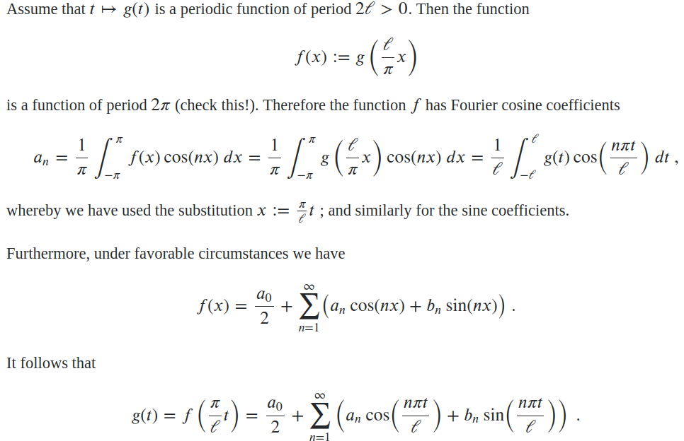

The transform is a method to convert a signal from one domain to another domain for extracting some other information contained in the signal which cannot be extracted from the signal in first domain. One of the important families of transforms is „Integral Transform‟. Actually, integral transform is an operator usedto transform a signal into its equivalent form with the help of a „kernel‟ function by integrating the kernel multiplied signal. The integration process involved in transformation has conferred the name as „Integral Transform‟.Fourier transforms play an important part in the theory of many branches of science. A waveform-optical, electrical or acoustical-and its spectrum are appreciated equally as physically picturable and measurable entities, an oscilloscope enables us to see an electrical waveform and a spectroscope or spectrum analyzer enables us to see optical or electrical spectra. Our acoustical appreciation is even more direct, since the ear hears spectra. Wave forms and spectra are Fourier transforms of each other; the Fourier transformation is thus an eminently physical relationship. The theory of Laplace transforms referred to as operational calculus has in recent years become an essential part of the mathematical background required of engineers, physicists, mathematicians and other scientist. This is because in addition to being of great theoretical interest in itself, Laplace transform methods provide easy and effective means for the solution of many problems arising in various fields of science and engineering.So these Fourier and Laplace transforms have various uses in many fields separately. On combining these two transforms i.e. Fourier-Laplace transforms also used for solving differential and integral equations. In this paper we find the Fourier-Laplace transform of some special functions which is help for solving differential equations.

## Fourier series

- Taylor series approximates a complicated function using a series of simpler polynomial functions that are often easier to evaluate. The key idea is to use a series of increasing powers to express complicated yet well-behaved (infinitely differentiable and continuous) functions.
- Unlike Taylor series, a Fourier series can describe functions that are
  not everywhere continuous and/or differentiable.
- There are also other advantages
  in using trigonometric terms. They are easy to differentiate and integrate, their
  moduli are easily taken and each term contains only one characteristic frequency.

The particular
conditions that a function f(x) must fulfil in order that it may be expanded as a
Fourier series are known as the Dirichlet conditions

- the function must be periodic
- it must be single-valued and continuous, except possibly at a finite number of finite discontinuities
- it must have only a finite number of maxima and minima within one period
- the integral over one period of `|f(x)|` must converge

> All the terms of a Fourier series are mutually orthogonal

> If we wish to find the Fourier series of a non-periodic function only within a fixed range then we may continue the function outside the range so as to make it periodic.

## 3B1B

## Fourier Transform

You might be able to see how this machine lets us pick out the frequency of a signal. You can take a different pure signal, let's say with a lower frequency of two beats per second, and wind it around a circle, imagine different potential winding frequencies, and as you do that keep track of where the center of mass of that graph is, and then plot the x coordinate of that center of mass as you adjust the winding frequency. We will get a spike when the winding frequency is the same as the signal frequency in this case two cycle per second.

Euler's formula famously tells us that if you take `e` to some number times `i`, you gonna land on the point that you get if you were to talk that number of units around a circle with radius 1, counterclockwise starting on the right.

First off, the convention in the context of fourier transforms is to think about rotating in the clockwise direction,

If you multiply this exponential expression `e^(-2pi*i*f*t)` times `g(t)` it means that the rotating complex number is getting scaled up and down according to the value of this function. So you can think of this little rotating vector with its changing length. So think about it, this is awesome.

This really small expression is a super-elegant way to encapsulate the whole idea of winding a graph around a circle with a variable frequency `f`.

And remember, that thing we want to do with this wind up graph is to track its center of mass. So think about what formula is going to capture that. Well, to approximate it at least, you might sample a whole bunch of times from the original signal, see where those points end up on the wind up graph, and then just take an average. This will become more accurate if you sample more points which are closer together. Then the best way is you take an integral of this function, divided by the size of the time interval that we're looking for.

The whole integral expression is just the center of mass of the winding up graph.

> The Fourier transform is just the integral part of the expression, don't divided the size of the time interval. What that means is that instead of looking at the center of mass, you would scale it up by some amount. Physically this has the effect that when a certain frequency persists for a long time, then the magnitude of the fourier transform at that frequency is scaled up more and more.

[selectedsolutions](http://www.selectedsolutions.net/)

[Use LT to solve DE](https://www.quora.com/Can-you-explain-how-the-Laplace-transform-is-used-to-solve-differential-equations-I-know-the-definition-of-the-transform-as-an-improper-integral-and-Ive-seen-a-visualization-of-it-but-Ive-got-no-idea-how-it-helps)

It must also be noted that not all functions have a Laplace transform. For example, the function 1/t does not have a Laplace transform as the integral diverges for all s. Similarly, tan(t) or e^(t^2) do not have Laplace transforms.

[Uniqueness](<https://math.libretexts.org/Bookshelves/Differential_Equations/Book%3A_Differential_Equations_for_Engineers_(Lebl)/6%3A_The_Laplace_Transform/6.1%3A_The_Laplace_Transform>)

[Laplace Transform of Periodic Function](https://proofwiki.org/wiki/Laplace_Transform_of_Periodic_Function)

[Final Value Theorem in Laplace Transform](https://www.electrical4u.com/final-value-theorem-of-laplace-transform/)

## How to memorize those transformation

The behavior of a laplace-transformed function F(s) as s->infinity depends on the function's behavior as x-> 0. For example, functions that don't decay near x=0, such as f(x)=1, f(x)=cos(x), f(x)=cosh(x), f(x)=e^-x , decay like 1/s as s gets large. Functions that decay lineary near x=0, such as f(x)=x, f(x)=sin(x), or f(x)=sinh(x) , decay like 1/s^2 as s gets large. The general relation being: if f(x)->0 faster as x->0, then F(s) has faster decay near s=infinity. You might also want to think about what happens when f(x) is identically zero near x=0.

## What is a Fourier series?

- What does it mean to solve a PDE with a discontinuous initial condition?
- Is the limit of a sequence of solutions also a solution?
- Do all functions have a fourier series?

Our goal is to express any arbitrary function f(t) as a sum of terms like this, so we need some way to pick out these constants one by one given the data of the function. The easiest one is the constant term. This term represents a sort of center of mass for the full drawing; if you were to sample a bunch of evenly spaced values for the input `t` as it ranges from 0 to 1, the average of all the outputs of the function for those samples will be the constant term C0. Or more accurately, as you consider finer and finer samples, their average approaches C0 in the limit. What I'm describing, finer and finer sums of f(t) for sample of `t` from the input range, is an integral of f(t) from 0 to 1. Normally, since I'm framing this in terms of averages, you'd divide this Integral by the length of the interval. But that length is 1. We want to think of the function as a sum of these rotating vectors.

Each of these vectors make a whole number of rotations around 0, so its average value of as `t` goes from 0 to 1 will be 0. The only exception is that the constant term; since it stays static and doesn't rotate.

If you wanted to compute a different term like C_k in front of the vector rotating k cycles per second, then the trick is to first multiply f(t) by something which makes that vector hold still.

> All the complexity in the evolution that the heat equation implies is captured by this difference in decay rates for the different pure frequency components.

## Fourier series

[What is the difference between Fourier series and Fourier transformation?](https://math.stackexchange.com/questions/221137/what-is-the-difference-between-fourier-series-and-fourier-transformation)

# Fourier transform

The Fourier Transform is a Basis Transform from the Impulse Train basis to the basis of Sinusoids.

In general, any signal (a measurable quantity varying with time or some other parameter) can be denoted in one of two ways:

(1) it can be denoted in terms of its values at different points of time. This is called the time domain representation.

(2) it can be represented as the sum of multiple complex exponentials → signals of the form 𝑥(𝑡)=𝐶𝑒^(𝑗𝜔𝑡)
where C is a complex number and 𝜔 is a real number

Notice that both representations of the signal contain the exact same information, and it is possible to reconstruct one from the other.

The process by which we find the coefficients C for each value of ω is known as the Fourier Transform.

https://www.quora.com/What-is-the-Fourier-transform-and-how-does-it-function

## From Fourier series to Fourier integral

[A brief Introduction to all](http://www.thphys.nuim.ie/Notes/EE206/EE206_10.pdf)

[What boundary condition is imposed when Fourier transform is used for solving differential equation on infinite domain](https://math.stackexchange.com/q/2084704/736159)

[An Introduction to Separation of Variables](<https://people.math.rochester.edu/faculty/chaessig/students/McCrossen(S10).pdf>)
