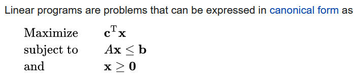

## Lecture-01

> In mathematical optimization, a feasible region, feasible set, search space, or solution space is the set of all possible points (sets of values of the choice variables) of an optimization problem that satisfy the problem's constraints, potentially including inequalities, equalities, and integer constraints.

The set of points, or values of the variables, which satisfy the constraints and the non-negativity condition is called the feasible set.

The inequalities Ax ≤ b and x ≥ 0 are the constraints which specify a convex polytope over which the objective function is to be optimized.

### Youtube video

- [Perfect Shapes in Higher Dimensions](https://www.youtube.com/watch?v=2s4TqVAbfz4)
- [The things you'll find in higher dimensions](https://www.youtube.com/watch?v=dr2sIoD7eeU)
- [Mod-01 Lec-05 Convex sets, dimension of a polyhedron, Faces, Example of a polytope.](https://www.youtube.com/watch?v=eXGOBmSBze8)

### Fundamental Theorem of Linear Programming

> If there is a solution to a linear programming problem, then it will occur at a corner point, or on a line segment between two corner points.

### Main Features of the standard form:

- The objective function is of the maximization or minimization type
- All constraints are expressed as equations
- All variables are restricted to be nonnegative
- The right-hand side constant of each constraint is nonnegative

## Lecture-02

- **Basic Feasible Solution:** A basic solution is called a basic feasible solution if it satisfies the non-negativity restriction.

- **Non-degenerate Basic Feasible Solution:** A basic feasible solution in which all the basic variables are positive is said to be non-degenerate basic feasible solution.

- **Degenerate Basic Feasible Solution:** A basic feasible solution in which one or more basic variables are zero is called a degenerate basic feasible solution.

- **Optimum Solution:** Any basic feasible solution which optimizes the objective function of the general LPP is known as an optimum solution to the LLP.

A linear program in canonical form can be replaced by a linear program in standard form by just
replacing Ax ≤ b by Ax + Is = b, s ≥ 0 where s is a vector of slack variables and I is the m × m
identity matrix.

## Internet Study

- [Union Difference of CS](https://math.stackexchange.com/questions/1014953/union-and-difference-of-convex-set)

[ linear programming: CosmoLearning](https://www.youtube.com/playlist?list=PLaLOVNqqD-2E-LmVcc3xQZZYCZ5lz52uF)

[Fourier–Motzkin elimination](https://www.youtube.com/watch?v=cJTJ7KMFBIs&list=PLaLOVNqqD-2E-LmVcc3xQZZYCZ5lz52uF&index=7)

[Basic and Non-basic Variables, Feasible Region and Extreme Points](https://www.youtube.com/watch?v=CS4YtctxFi0)

[MOOCOR Topic6 Module 02](https://www.youtube.com/watch?v=gZYqXTU1Tz4)

The simplex algorithm is the original and still one of the most widely used methods for solving linear maximization problems. However, to apply it, the origin (all variables equal to 0) must be a feasible point. This condition is satisfied only when all the constraints (except non-negativity) are less-than constraints and with a positive constant on the right-hand side. The Big M method introduces surplus and artificial variables to convert all inequalities into that form. The "Big M" refers to a large number associated with the artificial variables, represented by the letter M.

[What to do about equality constraints in the Simplex Tableau method](https://math.stackexchange.com/a/1309525/736159)

[Big M method](https://en.wikipedia.org/wiki/Big_M_method#Other_usage)

http://arts.brainkart.com/article/big-m-method--introduction--1123/
