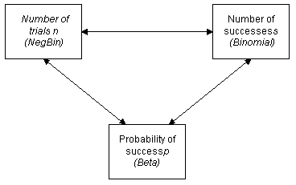

## MIT OpenCourseWare

- What are the dependencies in the sequence of values?
- What is the long term behaviour (LLN,CLT)?
- What are the boundary events?

[probability-course](https://www.probabilitycourse.com)

[Intuition for random variable being σ
-algebra measurable?](https://math.stackexchange.com/a/690905/736159)

https://math.stackexchange.com/a/508801/736159

[statistics-for-datascience](https://www.mygreatlearning.com/blog/covariance-vs-correlation/)

hand-write-note

## Poisson Process

> A Poisson distribution is a tool that helps to predict the probability of certain events from happening when you know how often the event has occurred. It gives us the probability of a given number of events happening in a fixed interval of time. Poisson distributions, valid only for integers on the horizontal axis.

A Poisson Process is a model for a series of discrete event where the average time between events is known, but the exact timing of events is random. The arrival of an event is independent of the event before (waiting time between events is memoryless).

For the Poisson process, arrivals may occur at arbitrary positive times, and the probability of an arrival at any particular instant is 0. This means that there is no very clean way of describing a Poisson process in terms of the probability of an arrival at any given instant.

A Poisson Process meets the following criteria (in reality many phenomena modeled as Poisson processes don’t meet these exactly):

- Events are independent of each other. The occurrence of one event does not affect the probability another event will occur.
- The average rate (events per time period) is constant.
- Two events cannot occur at the same time.

The last point — events are not simultaneous — means we can think of each sub-interval of a Poisson process as a Bernoulli Trial, that is, either a success or a failure.

## difference between the quadratic variation and variance of a stochastic process

Ok the surface, there is a lot that is different between them. There is no variance of a stochastic process, per se. There is only the variance of the individual random variables which make up the process. We can compute the variance at each time, and see how it behaves as a function of time. This will be a regular real valued function. It encodes some useful information about the extent to which a process spreads out over time. For Brownian motion, the variance at time t is equal to t. For a mean reverting process, the variance is bounded.

The quadratic variation is not computed like variance. Variance worked with all possible realizations, but at a fixed time. Quadratic variation works with a single realization, but at all times. The computation for each realization is patched together, to yield quadratic variation as a true random process in its own right. In this sense, calculating quadratic variation is a procedure which belongs to analysis.

A key connection between the two comes from martingale theory. For a martingale M
, M2−[M] is a martingale, modulo technicalities. Unpacking this math, if we square a martingale and subtract its quadratic variation, it is again a martingale. First of all, this means that the expected value of the quadratic variation is equal to the variance of the martingale. This means that the quadratic variation process can be used to measure the spreadout-ness of a process, and we can even do this when the variance itself is not defined, because the martingale is not square integrable. The quadratic variation is also referred to as the natural clock of a martingale because of this connection.

## Important links

- [Martingales and stopping time](https://ocw.mit.edu/courses/sloan-school-of-management/15-070j-advanced-stochastic-processes-fall-2013/lecture-notes/MIT15_070JF13_Lec10.pdf)

- [SOME BASIC PROPERTIES OF BROWNIAN MOTION](http://www.math.uchicago.edu/~may/VIGRE/VIGRE2009/REUPapers/McKnight.pdf)

- [What is the Kolmogorov Extension Theorem good for?](https://math.stackexchange.com/questions/94441/what-is-the-kolmogorov-extension-theorem-good-for)

> a two-sided Brownian motion cannot be a martingale nor even a local martingale in any filtration and you therefore cannot perform stochastic integration with respect to it.

## `https://onlinelibrary.wiley.com/doi/pdf/10.1002/9781119197096.app07`

A stochastic process is nothing but a mathematically defined equation that can create a series of outcomes over time, outcomes that are not deterministic in nature. That is, it is an equation or a process that does not follow any simple discernible rule such as: price will increase X percent every year, or revenues will increase by this factor of X plus Y percent. A stochastic process is by definition nondeterministic and not static, and one can plug different numbers into a stochastic process equation and obtain different results every time. Instead of dealing with a single reality, a stochastic process models the randomness and indeterminacy of the future outcomes. The current initial value is known but the future paths are unknown; however, certain paths are more probable than others. Therefore, to model a stochastic process, probability distributions and simulation techniques are required.

For instance, the path of a stock price is stochastic in nature, and one cannot reliably predict the stock price path with any certainty. However, the price evolution over time is enveloped in a process that generates these prices. The process is fixed and predetermined, but the outcomes are not. Hence, by stochastic simulation, we create multiple pathways of prices, obtain a statistical sampling of these simulations, and make inferences on the potential pathways that the actual price may undertake given the nature and parameters of the stochastic process used to generate the time series.The interesting thing about stochastic process simulation is that historical data arenot necessarily required; that is, the model does not have to fit any sets of historical data. To run a stochastic process forecast, either compute the expected returns andthe volatility of the historical data, estimate them using comparable external data, or make assumptions about these values based on expert judgment and expectations.

[MIT complete Course](https://ocw.mit.edu/courses/sloan-school-of-management/15-070j-advanced-stochastic-processes-fall-2013/lecture-notes/)
