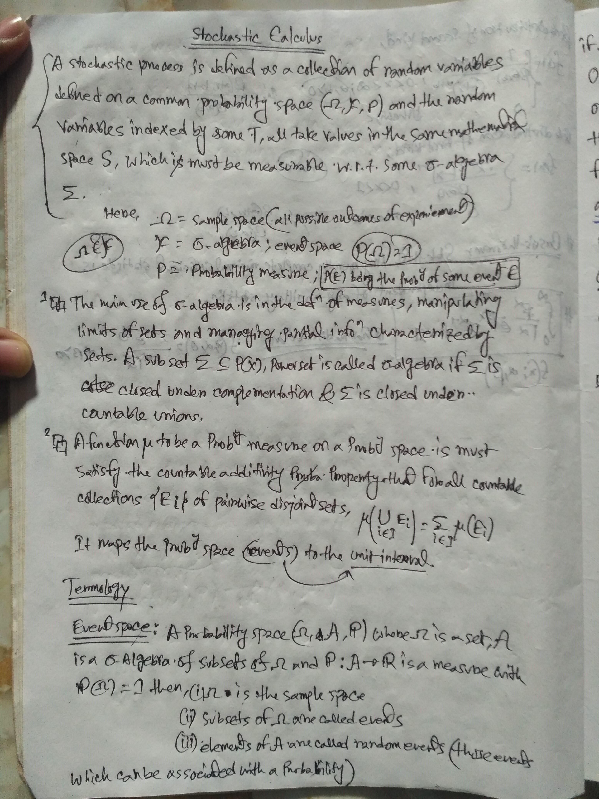
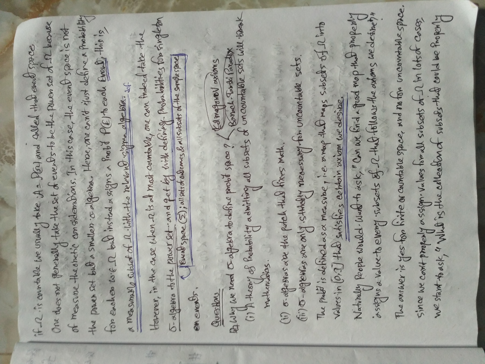
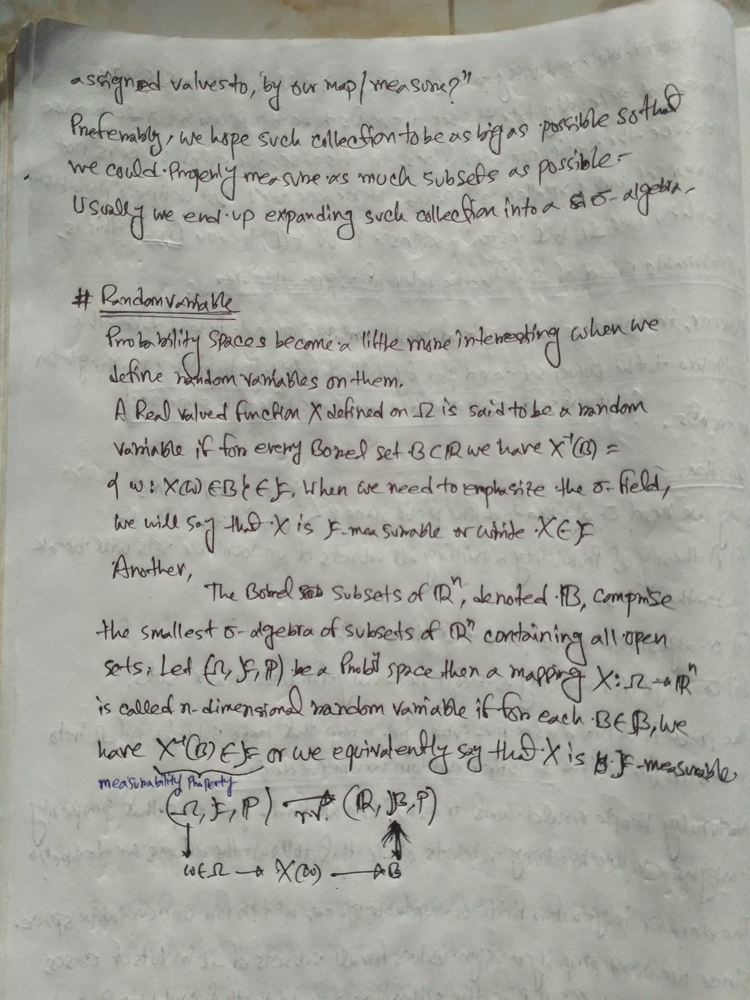
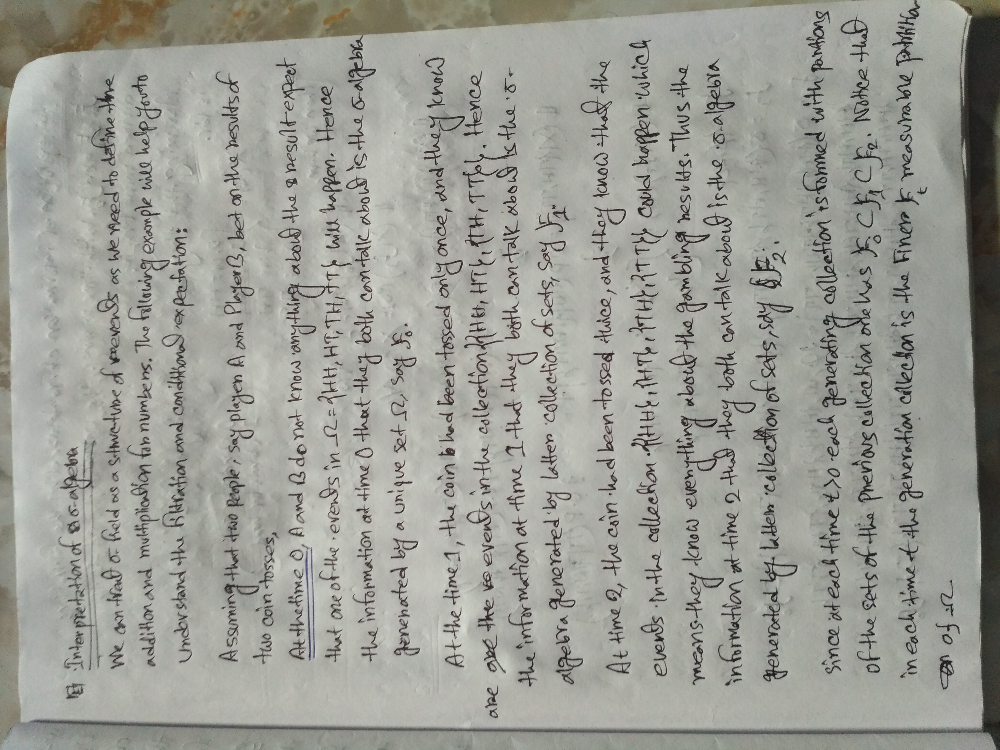
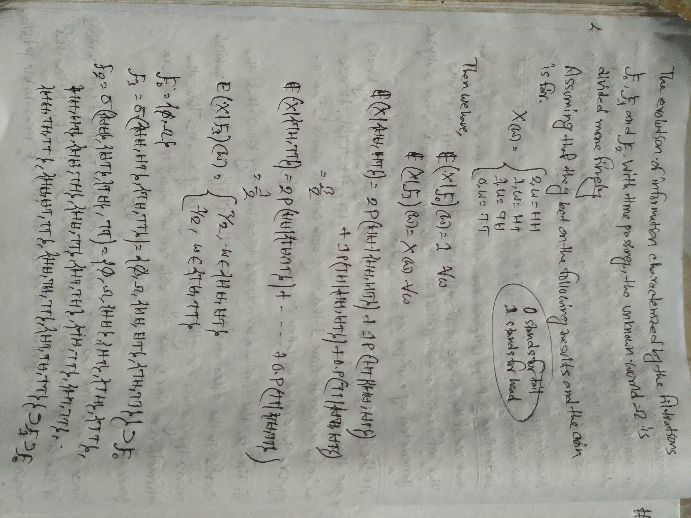
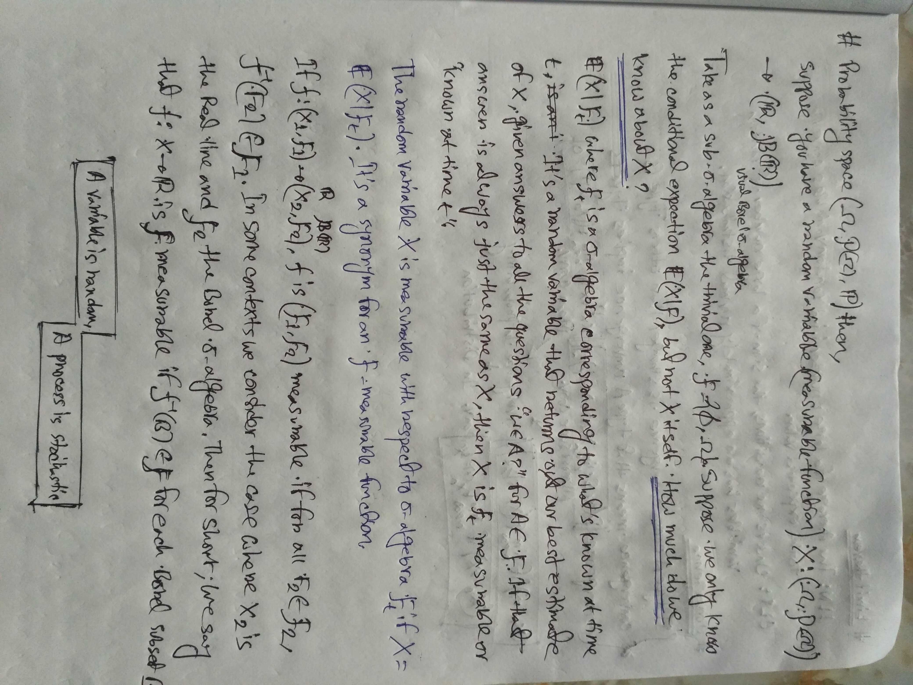

## MIT OpenCourseWare

- What are the dependencies in the sequence of values?
- What is the long term behaviour (LLN,CLT)?
- What are the boundary events?

[probability-course](https://www.probabilitycourse.com)

[Intuition for random variable being σ
-algebra measurable?](https://math.stackexchange.com/a/690905/736159)

https://math.stackexchange.com/a/508801/736159

[statistics-for-datascience](https://www.mygreatlearning.com/blog/covariance-vs-correlation/)

