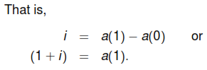
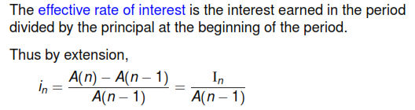
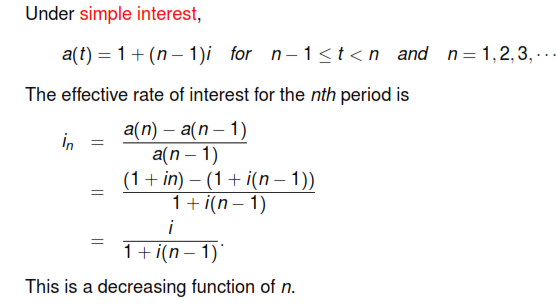
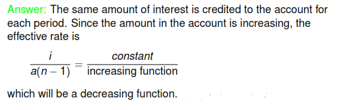

## Problem

[4.5](https://www.youtube.com/watch?v=Nohj7ftH-Ak&list=PLdMfoghed2YJhK9bdhgSLeicrwEMVWTR_&index=8)

Discounted Value means what is the value today of money to be received in the future.

In general, a higher the discount means that there is a greater the level of risk associated with an investment and its future cash flows. Discounting is the primary factor used in pricing a stream of tomorrow's cash flows. For example, a bond can have a par value of $1,000 and be priced at a 20% discount, which is $800. In other words, the investor can purchase the bond today for a discount and receive the full face value of the bond at maturity. The difference is the investor's return.

The more periods(n) the investment or loan compounds, the higher the effective annual interest rate will be.

The effective rate of interest, i, is the amount that 1
invested at the beginning of the period will earn during the period
when the interest is paid at the end of the period.

Why is it decreasing?

## Lecture-07 Annuity

## Problem

[5.16](https://www.youtube.com/watch?v=ZccLf2LSRKw&list=PLdMfoghed2YJhK9bdhgSLeicrwEMVWTR_&index=16)
